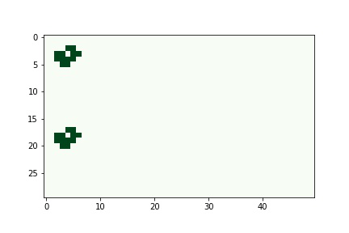
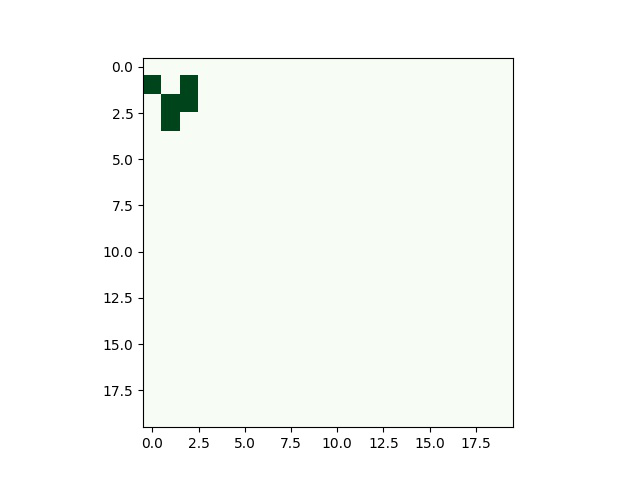
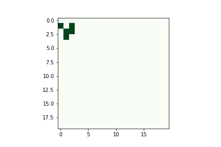

# Game of life - OpenMPI

The GitHub repository contains the main (game.cpp) and post processing(post_pro.ipynb). In the beginning of game.cpp, the user can specify: the Boolean variable for periodic, integer variables for global domains size (imax & jmax) and an integer variable for the number of times games will be played (no_steps). When executed, files with iteration number and indices will be written out (example: it_3_row_1_col_0.txt).

Post_pro.ipynb is responsible for merging files for each iteration into a singular file according to indices such as iteration_3.txt. It also converts these singular files into images (.jpg format) for easier analysis and creates a GIF video for the whole game.

## Implementing

Compile 
```
mpicxx game.cpp -std=c++11
```

Run
```
mpirun a.out
```

Seperate output files can be merged and animated using the [Post Processing](https://github.com/vagifaliyev/GameOfLife/blob/master/post_pro.ipynb)

## Example

Implementation of few famous patterns for check -> done for 100 iterations

### SpaceShip

Light-weight spaceship (LWSS)



### Glider

The glider is a pattern that travels across the board

 Periodic            |  non-Periodic
:-------------------------:|:-------------------------:
  |  


## Built With

* [C++](http://www.cplusplus.com/) - Programming Language
* [Open MPI](https://www.open-mpi.org/) - Message Passing Interface

## Analysis 

Output from multi-core tests on the system and the graphs are avaliable for view in [HPC](./HPC).

The analysis is documented in [Analysis.pdf](./Analysis.pdf) 

## Authors

* **Vagif Aliyev** - [Github](https://github.com/vagifaliyev)

## License

This project is licensed under the MIT License - see the [LICENSE.md](LICENSE.md) file for details
